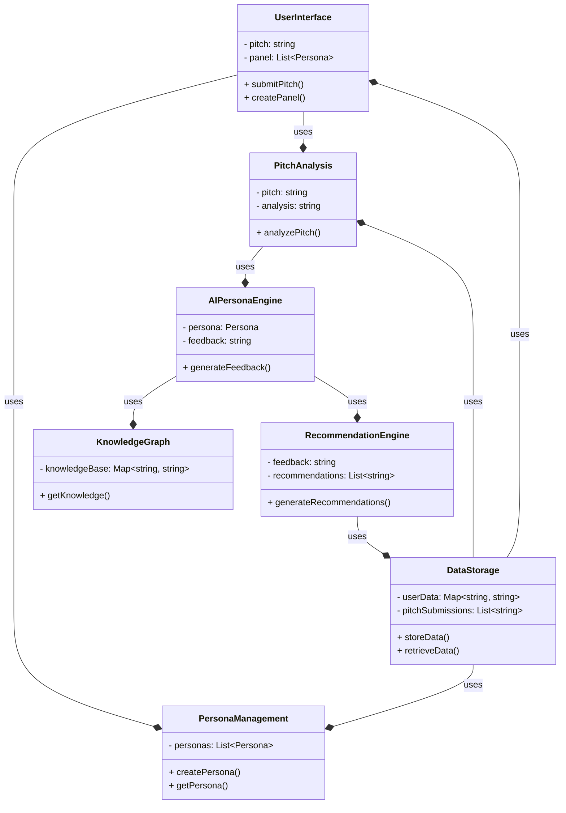
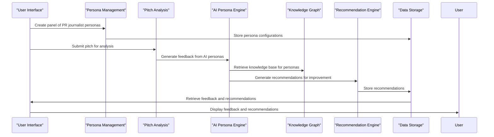
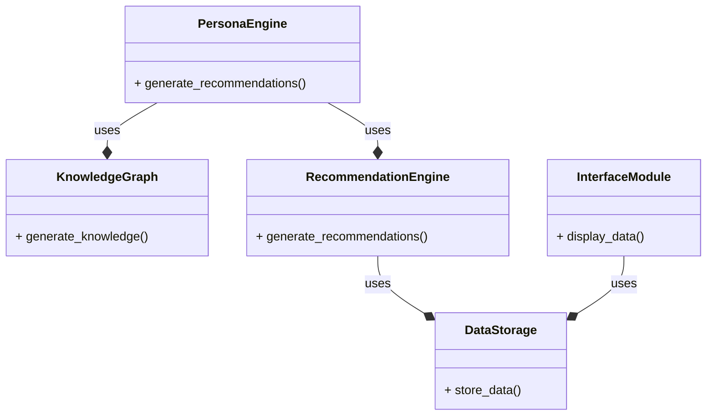
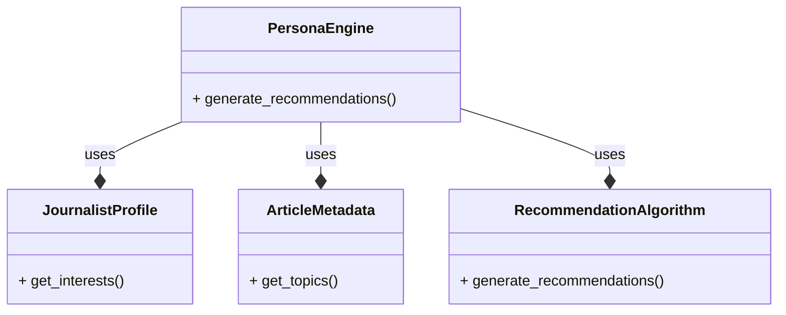
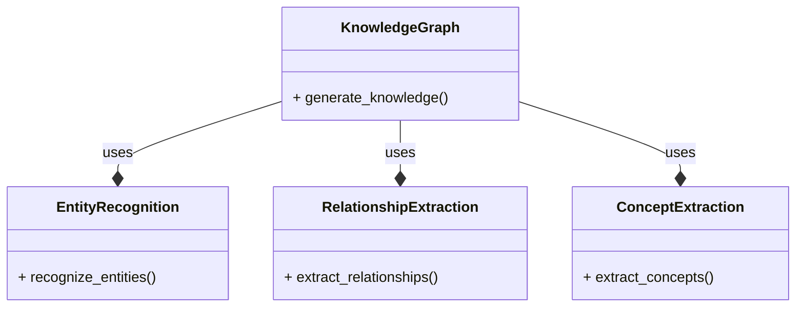
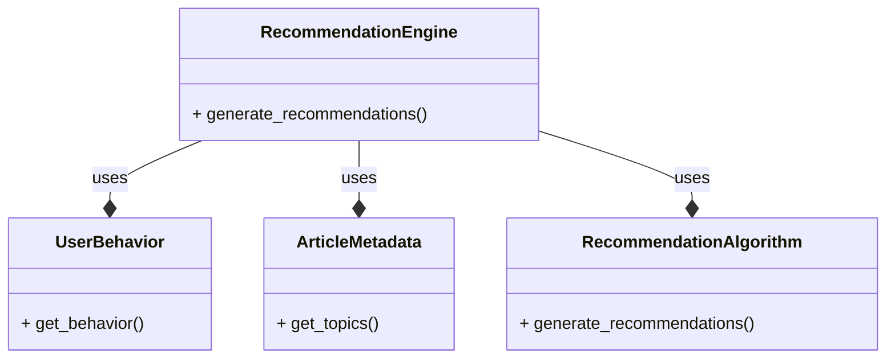
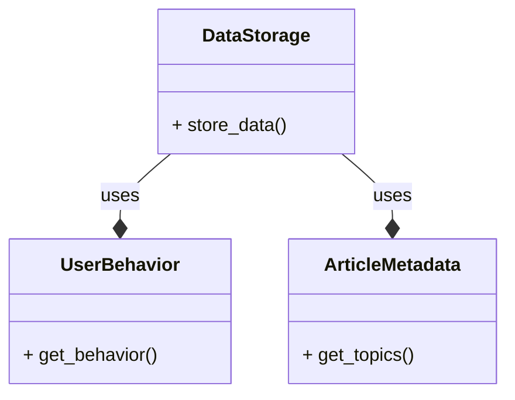

**System Architecture: AI-Driven Web App for PR Journalist Personas**
====================================================================

### Overview

The proposed system will be designed as a modular, microservices-based architecture to ensure scalability, maintainability, and flexibility. The system will consist of the following modules:

1. **User Interface (UI) Module**: Responsible for user interaction, pitch submission, and panel creation.
2. **Persona Management Module**: Manages the creation, configuration, and retrieval of AI personas.
3. **Pitch Analysis Module**: Analyzes the user-submitted pitch and generates feedback using natural language processing (NLP) and machine learning (ML) techniques.
4. **AI Persona Engine Module**: Simulates the behavior of PR journalist personas, providing feedback and criticism on the pitch.
5. **Knowledge Graph Module**: Stores and manages the knowledge base of PR journalist personas, including their expertise, interests, and preferences.
6. **Recommendation Engine Module**: Provides suggestions for improving the pitch based on the feedback and criticism from the AI personas.
7. **Data Storage Module**: Responsible for storing and retrieving user data, pitch submissions, and AI persona configurations.

### Mermaid Class Diagram

### Module Interactions

The following sequence diagram illustrates the interactions between modules:

### Module Responsibilities

1. **User Interface (UI) Module**:
	* Handles user input and interactions
	* Creates and manages panels of PR journalist personas
	* Submits pitches for analysis
2. **Persona Management Module**:
	* Creates, configures, and retrieves AI personas
	* Stores and manages persona configurations
3. **Pitch Analysis Module**:
	* Analyzes user-submitted pitches using NLP and ML techniques
	* Generates feedback and criticism from AI personas
4. **AI Persona Engine Module**:
	* Simulates the behavior of PR journalist personas
	* Generates feedback and criticism on pitches
	* Uses knowledge graph to inform persona behavior
5. **Knowledge Graph Module**:
	* Stores and manages knowledge base of PR journalist personas
	* Provides expertise, interests, and preferences for personas
6. **Recommendation Engine Module**:
	* Generates suggestions for improving pitches based on feedback and criticism
	* Uses machine learning algorithms to provide personalized recommendations
7. **Data Storage Module**:
	* Stores and retrieves user data, pitch submissions, and AI persona configurations
	* Provides data for analysis and recommendation generation

### Technology Stack

The system will be built using a combination of technologies, including:

* Frontend: React or Angular for the user interface
* Backend: Node.js or Python for the API and module interactions
* Database: MongoDB or PostgreSQL for data storage
* NLP and ML libraries: NLTK, spaCy, scikit-learn, or TensorFlow for pitch analysis and recommendation generation
* Cloud platform: AWS or Google Cloud for deployment and scalability

### Conclusion

The proposed system architecture provides a modular and scalable design for an AI-driven web app that simulates the behavior of PR journalist personas. Each module has a unique responsibility, and the interactions between modules are clearly defined. The system uses a combination of NLP, ML, and knowledge graph technologies to provide personalized feedback and recommendations for improving pitches.

**Summary of the Project**
-------------------------

The project is a PR platform that uses AI and machine learning to analyze and generate personalized recommendations for journalists and other stakeholders. The platform consists of several modules, including:

1. **Persona Engine**: generates personalized recommendations for journalists and other stakeholders based on their interests and preferences.
2. **Knowledge Graph**: stores and manages the knowledge base of the platform, including information about journalists, publications, and topics.
3. **Recommendation Engine**: generates recommendations for journalists and other stakeholders based on their behavior and preferences.
4. **Data Storage**: stores and manages the data generated by the platform, including user behavior and article metadata.
5. **Interface Module**: provides a user interface for journalists and other stakeholders to interact with the platform.

**Mermaid Diagrams**
-------------------

Here are several mermaid diagrams that show how the project works:

**Diagram 1: Overall Architecture**

**Diagram 2: Persona Engine**

**Diagram 3: Knowledge Graph**

**Diagram 4: Recommendation Engine**

**Diagram 5: Data Storage**

**Jira Tickets**
----------------

Here is a set of Jira tickets that decompose the task into smaller tasks with time estimates for a single person:

1. **Task 1: Design the overall architecture of the platform** (2 days)
	* Description: Design the overall architecture of the platform, including the modules and their interactions.
	* Time estimate: 2 days
2. **Task 2: Implement the Persona Engine** (5 days)
	* Description: Implement the Persona Engine, including the journalist profile, article metadata, and recommendation algorithm.
	* Time estimate: 5 days
3. **Task 3: Implement the Knowledge Graph** (5 days)
	* Description: Implement the Knowledge Graph, including entity recognition, relationship extraction, and concept extraction.
	* Time estimate: 5 days
4. **Task 4: Implement the Recommendation Engine** (5 days)
	* Description: Implement the Recommendation Engine, including user behavior, article metadata, and recommendation algorithm.
	* Time estimate: 5 days
5. **Task 5: Implement the Data Storage** (3 days)
	* Description: Implement the Data Storage, including user behavior and article metadata.
	* Time estimate: 3 days
6. **Task 6: Implement the Interface Module** (3 days)
	* Description: Implement the Interface Module, including the user interface and display of data.
	* Time estimate: 3 days
7. **Task 7: Integrate the modules** (5 days)
	* Description: Integrate the modules, including the Persona Engine, Knowledge Graph, Recommendation Engine, Data Storage, and Interface Module.
	* Time estimate: 5 days
8. **Task 8: Test and refine the platform** (10 days)
	* Description: Test and refine the platform, including testing the modules and their interactions.
	* Time estimate: 10 days

Total time estimate: 40 days