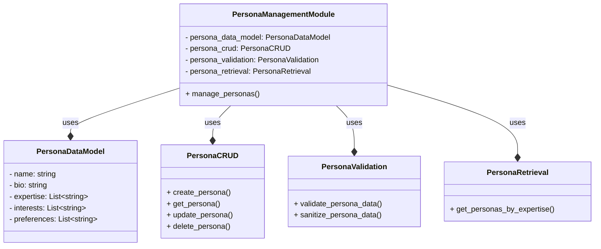

**Implementing Persona Management Module**
=============================================

### Step 1: Define the Persona Data Model

* Define the attributes and characteristics of a persona, such as:
	+ Name
	+ Bio
	+ Expertise
	+ Interests
	+ Preferences

```python
class PersonaDataModel:
    def __init__(self, name, bio, expertise, interests, preferences):
        self.name = name
        self.bio = bio
        self.expertise = expertise
        self.interests = interests
        self.preferences = preferences
```

### Step 2: Design the Persona Database

* Choose a suitable database management system, such as Google Cloud Firestore
* Design the database schema to store persona data

```python
from google.cloud import firestore

db = firestore.Client()
```

### Step 3: Implement Persona CRUD Operations

* Create functions to perform CRUD (Create, Read, Update, Delete) operations on personas

```python
class PersonaCRUD:
    def __init__(self):
        self.personas = db.collection('personas')

    def create_persona(self, persona):
        self.personas.document(persona.name).set({
            'bio': persona.bio,
            'expertise': persona.expertise,
            'interests': persona.interests,
            'preferences': persona.preferences
        })

    def get_persona(self, name):
        persona_ref = self.personas.document(name)
        persona = persona_ref.get()
        if persona.exists:
            return PersonaDataModel(
                name=persona.id,
                bio=persona.to_dict()['bio'],
                expertise=persona.to_dict()['expertise'],
                interests=persona.to_dict()['interests'],
                preferences=persona.to_dict()['preferences']
            )
        else:
            return None

    def update_persona(self, persona):
        self.personas.document(persona.name).update({
            'bio': persona.bio,
            'expertise': persona.expertise,
            'interests': persona.interests,
            'preferences': persona.preferences
        })

    def delete_persona(self, name):
        self.personas.document(name).delete()
```

### Step 4: Implement Persona Validation and Sanitization

* Create functions to validate and sanitize persona data

```python
class PersonaValidation:
    def validate_persona_data(self, persona):
        if not persona.name or not persona.bio:
            return False
        return True

    def sanitize_persona_data(self, persona):
        persona.bio = persona.bio.strip()
        return persona
```

### Step 5: Implement Persona Retrieval and Filtering

* Create functions to retrieve and filter personas based on various criteria

```python
class PersonaRetrieval:
    def __init__(self):
        self.personas = db.collection('personas')

    def get_personas_by_expertise(self, expertise):
        personas_ref = self.personas.where('expertise', 'array_contains', expertise)
        personas = personas_ref.stream()
        return [PersonaDataModel(
            name=persona.id,
            bio=persona.to_dict()['bio'],
            expertise=persona.to_dict()['expertise'],
            interests=persona.to_dict()['interests'],
            preferences=persona.to_dict()['preferences']
        ) for persona in personas]
```

### Mermaid Diagram: Persona Management Module Components



### Google Colab Code

```python
from google.cloud import firestore

db = firestore.Client()

class PersonaDataModel:
    def __init__(self, name, bio, expertise, interests, preferences):
        self.name = name
        self.bio = bio
        self.expertise = expertise
        self.interests = interests
        self.preferences = preferences

class PersonaCRUD:
    def __init__(self):
        self.personas = db.collection('personas')

    def create_persona(self, persona):
        self.personas.document(persona.name).set({
            'bio': persona.bio,
            'expertise': persona.expertise,
            'interests': persona.interests,
            'preferences': persona.preferences
        })

    def get_persona(self, name):
        persona_ref = self.personas.document(name)
        persona = persona_ref.get()
        if persona.exists:
            return PersonaDataModel(
                name=persona.id,
                bio=persona.to_dict()['bio'],
                expertise=persona.to_dict()['expertise'],
                interests=persona.to_dict()['interests'],
                preferences=persona.to_dict()['preferences']
            )
        else:
            return None

    def update_persona(self, persona):
        self.personas.document(persona.name).update({
            'bio': persona.bio,
            'expertise': persona.expertise,
            'interests': persona.interests,
            'preferences': persona.preferences
        })

    def delete_persona(self, name):
        self.personas.document(name).delete()

class PersonaValidation:
    def validate_persona_data(self, persona):
        if not persona.name or not persona.bio:
            return False
        return True

    def sanitize_persona_data(self, persona):
        persona.bio = persona.bio.strip()
        return persona

class PersonaRetrieval:
    def __init__(self):
        self.personas = db.collection('personas')

    def get_personas_by_expertise(self, expertise):
        personas_ref = self.personas.where('expertise', 'array_contains', expertise)
        personas = personas_ref.stream()
        return [PersonaDataModel(
            name=persona.id,
            bio=persona.to_dict()['bio'],
            expertise=persona.to_dict()['expertise'],
            interests=persona.to_dict()['interests'],
            preferences=persona.to_dict()['preferences']
        ) for persona in personas]

class PersonaManagementModule:
    def __init__(self):
        self.persona_data_model = PersonaDataModel
        self.persona_crud = PersonaCRUD()
        self.persona_validation = PersonaValidation()
        self.persona_retrieval = PersonaRetrieval()

    def manage_personas(self):
        persona = PersonaDataModel('John Doe', 'Bio', ['Expertise1', 'Expertise2'], ['Interest1', 'Interest2'], ['Preference1', 'Preference2'])
        if self.persona_validation.validate_persona_data(persona):
            self.persona_crud.create_persona(persona)
            print('Persona created successfully!')
        else:
            print('Invalid persona data!')

persona_management_module = PersonaManagementModule()
persona_management_module.manage_personas()
```


**PersonaModel Schema**
=========================

The following is a proposed schema for the PersonaModel:

```json
{
  "$schema": "http://json-schema.org/draft-07/schema#",
  "title": "PersonaModel",
  "description": "A model representing a persona",
  "type": "object",
  "properties": {
    "id": {
      "type": "string",
      "description": "Unique identifier for the persona"
    },
    "name": {
      "type": "string",
      "description": "Name of the persona"
    },
    "bio": {
      "type": "string",
      "description": "Biography of the persona"
    },
    "expertise": {
      "type": "array",
      "items": {
        "type": "string"
      },
      "description": "List of areas of expertise for the persona"
    },
    "interests": {
      "type": "array",
      "items": {
        "type": "string"
      },
      "description": "List of interests for the persona"
    },
    "preferences": {
      "type": "array",
      "items": {
        "type": "string"
      },
      "description": "List of preferences for the persona"
    },
    "created_at": {
      "type": "string",
      "format": "date-time",
      "description": "Timestamp when the persona was created"
    },
    "updated_at": {
      "type": "string",
      "format": "date-time",
      "description": "Timestamp when the persona was last updated"
    }
  },
  "required": [
    "name",
    "bio",
    "expertise",
    "interests",
    "preferences"
  ]
}
```

**Database Schema ( Firestore )**
--------------------------------

If you are using Firestore as your database, the schema would be:

```json
{
  "fields": {
    "id": {
      "type": "string"
    },
    "name": {
      "type": "string"
    },
    "bio": {
      "type": "string"
    },
    "expertise": {
      "type": "array",
      "arrayType": "string"
    },
    "interests": {
      "type": "array",
      "arrayType": "string"
    },
    "preferences": {
      "type": "array",
      "arrayType": "string"
    },
    "created_at": {
      "type": "timestamp"
    },
    "updated_at": {
      "type": "timestamp"
    }
  }
}
```

**Python Class Representation**
------------------------------

Here's how the PersonaModel schema would look like as a Python class:

```python
from dataclasses import dataclass
from datetime import datetime
from typing import List

@dataclass
class PersonaModel:
    id: str
    name: str
    bio: str
    expertise: List[str]
    interests: List[str]
    preferences: List[str]
    created_at: datetime
    updated_at: datetime
```

Note that the `created_at` and `updated_at` fields are timestamp fields that store the date and time when the persona was created and last updated, respectively.


**Sample Persona: Rachel Chen**
==============================

**Name:** Rachel Chen
**Title:** Senior PR Journalist
**Publication:** The New York Times
**Bio:** Rachel Chen is a seasoned PR journalist with over 10 years of experience in covering the latest trends and developments in the public relations industry. She has a keen eye for storytelling and a deep understanding of the complexities of corporate communications. Rachel is known for her incisive questions and her ability to get to the heart of the matter. She is a sought-after speaker and moderator at industry conferences and has written for numerous publications, including The New York Times, Forbes, and PRWeek.

**Expertise:**

* Corporate communications
* Crisis communications
* Reputation management
* Media relations
* Social media marketing

**Interests:**

* The intersection of technology and PR
* The role of social media in shaping public opinion
* The impact of fake news on the PR industry
* The future of work and the gig economy
* Diversity and inclusion in the workplace

**Preferences:**

* In-depth feature stories over quick soundbites
* Interviews with CEOs and other senior executives
* Stories that highlight the human side of business
* Data-driven journalism
* Collaborative storytelling with other journalists and experts

**Tone and Style:**

* Authoritative and informative, with a touch of humor
* Engaging and conversational, with a focus on storytelling
* Critical and analytical, with a commitment to fairness and balance

**Social Media:**

* Twitter: @rachelchen (10,000+ followers)
* LinkedIn: linkedin.com/in/rachelchen (5,000+ connections)
* Facebook: facebook.com/rachelchenjournalist (1,000+ followers)

**Pitch Preferences:**

* Email pitches with a clear and concise subject line
* Personalized pitches that demonstrate a clear understanding of her interests and expertise
* Pitches that include data and research to support the story
* Pitches that highlight the human side of the story
* Follow-up emails or phone calls to discuss the pitch in more detail

**Pet Peeves:**

* Generic or spammy pitches that don't demonstrate a clear understanding of her interests and expertise
* Pitches that are too promotional or self-serving
* Pitches that don't include a clear and concise summary of the story
* Pitches that are sent to multiple journalists at once, without a clear explanation of why the story is relevant to each journalist

This sample persona provides a detailed and nuanced understanding of Rachel Chen's interests, expertise, and preferences as a PR journalist. By understanding these factors, PR professionals can tailor their pitches and stories to resonate with Rachel and increase their chances of securing coverage in The New York Times.


**Database Entry for Rachel Chen**
=====================================

Here's an example of how the persona data for Rachel Chen could be stored in a database:

```json
{
  "id": "rachelchen",
  "name": "Rachel Chen",
  "title": "Senior PR Journalist",
  "publication": "The New York Times",
  "bio": "Rachel Chen is a seasoned PR journalist with over 10 years of experience in covering the latest trends and developments in the public relations industry.",
  "expertise": [
    "Corporate communications",
    "Crisis communications",
    "Reputation management",
    "Media relations",
    "Social media marketing"
  ],
  "interests": [
    "The intersection of technology and PR",
    "The role of social media in shaping public opinion",
    "The impact of fake news on the PR industry",
    "The future of work and the gig economy",
    "Diversity and inclusion in the workplace"
  ],
  "preferences": [
    "In-depth feature stories over quick soundbites",
    "Interviews with CEOs and other senior executives",
    "Stories that highlight the human side of business",
    "Data-driven journalism",
    "Collaborative storytelling with other journalists and experts"
  ],
  "tone_and_style": "Authoritative and informative, with a touch of humor",
  "social_media": {
    "twitter": "@rachelchen",
    "linkedin": "linkedin.com/in/rachelchen",
    "facebook": "facebook.com/rachelchenjournalist"
  },
  "pitch_preferences": [
    "Email pitches with a clear and concise subject line",
    "Personalized pitches that demonstrate a clear understanding of her interests and expertise",
    "Pitches that include data and research to support the story",
    "Pitches that highlight the human side of the story",
    "Follow-up emails or phone calls to discuss the pitch in more detail"
  ],
  "pet_peeves": [
    "Generic or spammy pitches that don't demonstrate a clear understanding of her interests and expertise",
    "Pitches that are too promotional or self-serving",
    "Pitches that don't include a clear and concise summary of the story",
    "Pitches that are sent to multiple journalists at once, without a clear explanation of why the story is relevant to each journalist"
  ],
  "created_at": "2022-01-01T12:00:00Z",
  "updated_at": "2022-01-01T12:00:00Z"
}
```

**Firestore Database Entry**
---------------------------

If you're using Firestore as your database, the entry would look like this:

```json
{
  "id": "rachelchen",
  "name": "Rachel Chen",
  "title": "Senior PR Journalist",
  "publication": "The New York Times",
  "bio": "Rachel Chen is a seasoned PR journalist with over 10 years of experience in covering the latest trends and developments in the public relations industry.",
  "expertise": {
    "arrayValue": {
      "values": [
        {
          "stringValue": "Corporate communications"
        },
        {
          "stringValue": "Crisis communications"
        },
        {
          "stringValue": "Reputation management"
        },
        {
          "stringValue": "Media relations"
        },
        {
          "stringValue": "Social media marketing"
        }
      ]
    }
  },
  "interests": {
    "arrayValue": {
      "values": [
        {
          "stringValue": "The intersection of technology and PR"
        },
        {
          "stringValue": "The role of social media in shaping public opinion"
        },
        {
          "stringValue": "The impact of fake news on the PR industry"
        },
        {
          "stringValue": "The future of work and the gig economy"
        },
        {
          "stringValue": "Diversity and inclusion in the workplace"
        }
      ]
    }
  },
  "preferences": {
    "arrayValue": {
      "values": [
        {
          "stringValue": "In-depth feature stories over quick soundbites"
        },
        {
          "stringValue": "Interviews with CEOs and other senior executives"
        },
        {
          "stringValue": "Stories that highlight the human side of business"
        },
        {
          "stringValue": "Data-driven journalism"
        },
        {
          "stringValue": "Collaborative storytelling with other journalists and experts"
        }
      ]
    }
  },
  "tone_and_style": "Authoritative and informative, with a touch of humor",
  "social_media": {
    "twitter": "@rachelchen",
    "linkedin": "linkedin.com/in/rachelchen",
    "facebook": "facebook.com/rachelchenjournalist"
  },
  "pitch_preferences": {
    "arrayValue": {
      "values": [
        {
          "stringValue": "Email pitches with a clear and concise subject line"
        },
        {
          "stringValue": "Personalized pitches that demonstrate a clear understanding of her interests and expertise"
        },
        {
          "stringValue": "Pitches that include data and research to support the story"
        },
        {
          "stringValue": "Pitches that highlight the human side of the story"
        },
        {
          "stringValue": "Follow-up emails or phone calls to discuss the pitch in more detail"
        }
      ]
    }
  },
  "pet_peeves": {
    "arrayValue": {
      "values": [
        {
          "stringValue": "Generic or spammy pitches that don't demonstrate a clear understanding of her interests and expertise"
        },
        {
          "stringValue": "Pitches that are too promotional or self-serving"
        },
        {
          "stringValue": "Pitches that don't include a clear and concise summary of the story"
        },
        {
          "stringValue": "Pitches that are sent to multiple journalists at once, without a clear explanation of why the story is relevant to each journalist"
        }
      ]
    }
  },
  "created_at": {
    "timestampValue": "2022-01-01T12:00:00Z"
  },
  "updated_at": {
    "timestampValue": "2022-01-01T12:00:00Z"
  }
}
```

**Python Code to Create Database Entry**
---------------------------------------

Here's an example of how you could create a database entry for Rachel Chen using Python:

```python
from google.cloud import firestore

db = firestore.Client()

persona_data = {
    "id": "rachelchen",
    "name": "Rachel Chen",
    "title": "Senior PR Journalist",
    "publication": "The New York Times",
    "bio": "Rachel Chen is a seasoned PR journalist with over 10 years of experience in covering the latest trends and developments in the public relations industry.",
    "expertise": [
        "Corporate communications",
        "Crisis communications",
        "Reputation management",
        "Media relations",
        "Social media marketing"
    ],
    "interests": [
        "The intersection of technology and PR",
        "The role of social media in shaping public opinion",
        "The impact of fake news on the PR industry",
        "The future of work and the gig economy",
        "Diversity and inclusion in the workplace"
    ],
    "preferences": [
        "In-depth feature stories over quick soundbites",
        "Interviews with CEOs and other senior executives",
        "Stories that highlight the human side of business",
        "Data-driven journalism",
        "Collaborative storytelling with other journalists and experts"
    ],
    "tone_and_style": "Authoritative and informative, with a touch of humor",
    "social_media": {
        "twitter": "@rachelchen",
        "linkedin": "linkedin.com/in/rachelchen",
        "facebook": "facebook.com/rachelchenjournalist"
    },
    "pitch_preferences": [
        "Email pitches with a clear and concise subject line",
        "Personalized pitches that demonstrate a clear understanding of her interests and expertise",
        "Pitches that include data and research to support the story",
        "Pitches that highlight the human side of the story",
        "Follow-up emails or phone calls to discuss the pitch in more detail"
    ],
    "pet_peeves": [
        "Generic or spammy pitches that don't demonstrate a clear understanding of her interests and expertise",
        "Pitches that are too promotional or self-serving",
        "Pitches that don't include a clear and concise summary of the story",
        "Pitches that are sent to multiple journalists at once, without a clear explanation of why the story is relevant to each journalist"
    ],
    "created_at": "2022-01-01T12:00:00Z",
    "updated_at": "2022-01-01T12:00:00Z"
}

db.collection("personas").document("rachelchen").set(persona_data)
```

Note: Make sure to install the `google-cloud-firestore` library and set up your Google Cloud credentials before running the code.