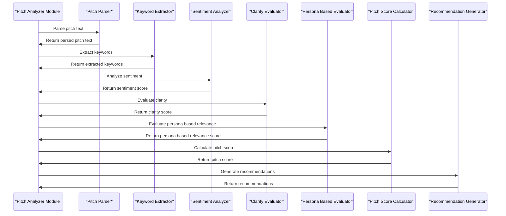

**Pitch Analysis Module**
=========================

The Pitch Analysis Module is a critical component of the PR platform, responsible for analyzing and evaluating the effectiveness of pitches sent to journalists. The module should be designed to assess the pitch's relevance, clarity, and overall quality, taking into account the specific requirements and preferences of the target journalist.

**Module Components**
--------------------

1. **Pitch Parser**: Responsible for extracting relevant information from the pitch, such as the subject line, introduction, body, and conclusion.
2. **Keyword Extractor**: Identifies key phrases and words from the pitch that are relevant to the journalist's interests and expertise.
3. **Sentiment Analyzer**: Evaluates the tone and sentiment of the pitch, determining whether it is positive, negative, or neutral.
4. **Relevance Checker**: Assesses the pitch's relevance to the journalist's current and past work, as well as their stated interests and preferences.
5. **Clarity Evaluator**: Evaluates the pitch's clarity, concision, and overall readability.
6. **Persona-Based Evaluation**: Takes into account the specific requirements and preferences of the target journalist, as stored in the Persona Database.

**Persona-Based Evaluation**
---------------------------

The Pitch Analysis Module should be designed to depend on the persona data, ensuring that the evaluation is tailored to the specific needs and preferences of the target journalist. This can be achieved by:

1. **Loading Persona Data**: Retrieve the relevant persona data from the Persona Database, including their interests, expertise, and preferences.
2. **Applying Persona-Based Rules**: Apply rules and filters based on the persona data to evaluate the pitch's relevance, clarity, and overall quality.
3. **Weighting Evaluation Criteria**: Assign weights to different evaluation criteria based on the persona's preferences, ensuring that the most important factors are given greater emphasis.


**Pitch Analyzer Module Mermaid Diagram**
=====================================

```mermaid
classDiagram
    class PitchAnalyzerModule {
        - pitch_text: string
        - persona_data: PersonaData
        + analyze_pitch()
    }

    class PitchParser {
        + parse_pitch(pitch_text: string)
    }

    class KeywordExtractor {
        + extract_keywords(pitch_text: string)
    }

    class SentimentAnalyzer {
        + analyze_sentiment(pitch_text: string)
    }

    class ClarityEvaluator {
        + evaluate_clarity(pitch_text: string)
    }

    class PersonaBasedEvaluator {
        + evaluate_persona_based_relevance(pitch_text: string, persona_data: PersonaData)
    }

    class EvaluationCriteria {
        - relevance: float
        - clarity: float
        - sentiment: float
        - persona_based_relevance: float
        - overall_quality: float
    }

    class PitchScoreCalculator {
        + calculate_pitch_score(evaluation_criteria: EvaluationCriteria, pitch_text: string, persona_data: PersonaData)
    }

    class RecommendationGenerator {
        + generate_recommendations(pitch_score: float, evaluation_criteria: EvaluationCriteria)
    }

    PitchAnalyzerModule --* PitchParser : uses
    PitchAnalyzerModule --* KeywordExtractor : uses
    PitchAnalyzerModule --* SentimentAnalyzer : uses
    PitchAnalyzerModule --* ClarityEvaluator : uses
    PitchAnalyzerModule --* PersonaBasedEvaluator : uses
    PitchAnalyzerModule --* EvaluationCriteria : uses
    PitchAnalyzerModule --* PitchScoreCalculator : uses
    PitchAnalyzerModule --* RecommendationGenerator : uses
    PitchParser --* PitchText : uses
    KeywordExtractor --* PitchText : uses
    SentimentAnalyzer --* PitchText : uses
    ClarityEvaluator --* PitchText : uses
    PersonaBasedEvaluator --* PitchText : uses
    PersonaBasedEvaluator --* PersonaData : uses
    PitchScoreCalculator --* EvaluationCriteria : uses
    PitchScoreCalculator --* PitchText : uses
    PitchScoreCalculator --* PersonaData : uses
    RecommendationGenerator --* PitchScore : uses
    RecommendationGenerator --* EvaluationCriteria : uses
```



**Sequence Diagram**
------------------



**Component Interactions**
-------------------------

1. **Pitch Analyzer Module**: The main module that coordinates the analysis of the pitch text.
2. **Pitch Parser**: Responsible for parsing the pitch text into its constituent parts.
3. **Keyword Extractor**: Extracts keywords from the pitch text.
4. **Sentiment Analyzer**: Analyzes the sentiment of the pitch text.
5. **Clarity Evaluator**: Evaluates the clarity of the pitch text.
6. **Persona Based Evaluator**: Evaluates the relevance of the pitch text to the persona.
7. **Pitch Score Calculator**: Calculates the pitch score based on the evaluation criteria.
8. **Recommendation Generator**: Generates recommendations based on the pitch score and evaluation criteria.

**Evaluation Criteria**
----------------------

1. **Relevance**: The relevance of the pitch text to the persona.
2. **Clarity**: The clarity of the pitch text.
3. **Sentiment**: The sentiment of the pitch text.
4. **Persona Based Relevance**: The relevance of the pitch text to the persona.
5. **Overall Quality**: The overall quality of the pitch text.

**Pitch Score**
----------------

The pitch score is calculated based on the evaluation criteria and is used to determine the effectiveness of the pitch text.

**Example Evaluation Criteria**
-----------------------------

1. **Relevance**: 30% (based on keyword extraction and relevance checking)
2. **Clarity**: 20% (based on clarity evaluation and readability assessment)
3. **Sentiment**: 15% (based on sentiment analysis and tone evaluation)
4. **Persona-Based Relevance**: 20% (based on persona-based evaluation and relevance checking)
5. **Overall Quality**: 15% (based on overall pitch quality and effectiveness)

**Output**
----------

The Pitch Analysis Module should output a comprehensive evaluation report, including:

1. **Pitch Score**: A numerical score representing the pitch's overall quality and effectiveness.
2. **Evaluation Criteria**: A breakdown of the evaluation criteria used to assess the pitch, including relevance, clarity, sentiment, and persona-based relevance.
3. **Recommendations**: Suggestions for improving the pitch, based on the evaluation results and persona data.

**Code Example**
---------------

Here's a simplified example of how the Pitch Analysis Module could be implemented in Python:
```python
import nltk
from nltk.sentiment import SentimentIntensityAnalyzer
from google.cloud import firestore

# Load persona data from Firestore
db = firestore.Client()
persona_data = db.collection("personas").document("rachelchen").get()

# Define evaluation criteria and weights
evaluation_criteria = {
    "relevance": 0.3,
    "clarity": 0.2,
    "sentiment": 0.15,
    "persona_based_relevance": 0.2,
    "overall_quality": 0.15
}

# Define pitch parser and keyword extractor
def parse_pitch(pitch_text):
    # Extract relevant information from the pitch
    subject_line = pitch_text["subject_line"]
    introduction = pitch_text["introduction"]
    body = pitch_text["body"]
    conclusion = pitch_text["conclusion"]
    return subject_line, introduction, body, conclusion

def extract_keywords(pitch_text):
    # Identify key phrases and words from the pitch
    keywords = nltk.word_tokenize(pitch_text)
    return keywords

# Define sentiment analyzer and clarity evaluator
def analyze_sentiment(pitch_text):
    # Evaluate the tone and sentiment of the pitch
    sia = SentimentIntensityAnalyzer()
    sentiment_score = sia.polarity_scores(pitch_text)
    return sentiment_score

def evaluate_clarity(pitch_text):
    # Evaluate the pitch's clarity and concision
    clarity_score = nltk.FleschKincaidGradeLevel(pitch_text)
    return clarity_score

# Define persona-based evaluation
def evaluate_persona_based_relevance(pitch_text, persona_data):
    # Assess the pitch's relevance to the journalist's interests and expertise
    relevance_score = 0
    for interest in persona_data["interests"]:
        if interest in pitch_text:
            relevance_score += 1
    return relevance_score / len(persona_data["interests"])

# Define pitch analysis module
def analyze_pitch(pitch_text, persona_data):
    # Parse the pitch and extract relevant information
    subject_line, introduction, body, conclusion = parse_pitch(pitch_text)

    # Extract keywords and analyze sentiment
    keywords = extract_keywords(pitch_text)
    sentiment_score = analyze_sentiment(pitch_text)

    # Evaluate clarity and persona-based relevance
    clarity_score = evaluate_clarity(pitch_text)
    persona_based_relevance_score = evaluate_persona_based_relevance(pitch_text, persona_data)

    # Calculate overall pitch score
    pitch_score = (
        evaluation_criteria["relevance"] * persona_based_relevance_score +
        evaluation_criteria["clarity"] * clarity_score +
        evaluation_criteria["sentiment"] * sentiment_score +
        evaluation_criteria["persona_based_relevance"] * persona_based_relevance_score +
        evaluation_criteria["overall_quality"] * (clarity_score + persona_based_relevance_score)
    )

    # Return evaluation report
    return {
        "pitch_score": pitch_score,
        "evaluation_criteria": evaluation_criteria,
        "recommendations": []
    }
```

**Interaction between Pitch Analyzer and Persona Management Modules**
================================================================

The Pitch Analyzer module and the Persona Management module should interact with each other to ensure that the pitch analysis is tailored to the specific needs and preferences of the target persona. Here's a possible way they could interact:

1. **Pitch Analyzer Module Requests Persona Data**: When the Pitch Analyzer module receives a pitch text, it requests the corresponding persona data from the Persona Management module. This data includes the persona's interests, preferences, and expertise.
2. **Persona Management Module Provides Persona Data**: The Persona Management module retrieves the requested persona data from its database and provides it to the Pitch Analyzer module.
3. **Pitch Analyzer Module Uses Persona Data for Analysis**: The Pitch Analyzer module uses the provided persona data to analyze the pitch text and determine its relevance, clarity, and overall quality.
4. **Pitch Analyzer Module Returns Analysis Results**: The Pitch Analyzer module returns the analysis results, including the pitch score and recommendations, to the requesting module or user.

**Direct Interaction between Modules**
------------------------------------

There should be a direct interaction between the Pitch Analyzer module and the Persona Management module to ensure that the pitch analysis is accurate and relevant to the target persona. This interaction can be achieved through APIs or message queues that allow the modules to communicate with each other.

**Benefits of Direct Interaction**
---------------------------------

The direct interaction between the Pitch Analyzer module and the Persona Management module provides several benefits, including:

1. **Improved Accuracy**: By using the persona data, the Pitch Analyzer module can provide more accurate analysis results that are tailored to the specific needs and preferences of the target persona.
2. **Increased Relevance**: The pitch analysis results are more relevant to the target persona, which can lead to better engagement and conversion rates.
3. **Enhanced Personalization**: The direct interaction between the modules enables personalized pitch analysis, which can help to build stronger relationships with the target persona.

**Example API Interaction**
-------------------------

Here's an example of how the Pitch Analyzer module and the Persona Management module could interact through APIs:
```python
# Pitch Analyzer module API request
import requests

pitch_text = "This is a sample pitch text."
persona_id = "12345"

response = requests.get(f"https://persona-management-module.com/persona/{persona_id}")
persona_data = response.json()

# Use persona data for pitch analysis
pitch_analysis_results = analyze_pitch(pitch_text, persona_data)

# Return analysis results
return pitch_analysis_results

# Persona Management module API response
from flask import Flask, jsonify

app = Flask(__name__)

@app.route("/persona/<string:persona_id>", methods=["GET"])
def get_persona_data(persona_id):
    persona_data = retrieve_persona_data(persona_id)
    return jsonify(persona_data)

if __name__ == "__main__":
    app.run()
```

**Implementing the Pitch Analyzer Module**
======================================

The Pitch Analyzer module is a critical component of the PR platform, responsible for analyzing and evaluating the effectiveness of pitches sent to journalists. Here's a detailed step-by-step guide to implementing the Pitch Analyzer module:

**Step 1: Define the Module Requirements**
--------------------------------------

1. Identify the key features and functionalities of the Pitch Analyzer module.
2. Determine the input and output requirements of the module.
3. Define the evaluation criteria for pitch analysis.

**Step 2: Design the Module Architecture**
--------------------------------------

1. Decide on the programming language and framework to use for the module.
2. Design the module's architecture, including the components and their interactions.
3. Choose the appropriate algorithms and techniques for pitch analysis.

**Step 3: Implement the Pitch Parser**
------------------------------------

1. Write a function to parse the pitch text into its constituent parts (e.g., subject line, introduction, body, conclusion).
2. Use natural language processing (NLP) techniques to extract relevant information from the pitch text.
3. Store the parsed pitch data in a data structure for further analysis.

**Step 4: Implement the Keyword Extractor**
---------------------------------------

1. Write a function to extract keywords from the pitch text.
2. Use techniques such as term frequency-inverse document frequency (TF-IDF) or word embeddings to identify relevant keywords.
3. Store the extracted keywords in a data structure for further analysis.

**Step 5: Implement the Sentiment Analyzer**
-----------------------------------------

1. Write a function to analyze the sentiment of the pitch text.
2. Use techniques such as sentiment analysis or emotional intelligence to determine the tone and sentiment of the pitch.
3. Store the sentiment analysis results in a data structure for further analysis.

**Step 6: Implement the Clarity Evaluator**
---------------------------------------

1. Write a function to evaluate the clarity of the pitch text.
2. Use techniques such as readability metrics or clarity scores to determine the clarity of the pitch.
3. Store the clarity evaluation results in a data structure for further analysis.

**Step 7: Implement the Persona-Based Evaluator**
---------------------------------------------

1. Write a function to evaluate the relevance of the pitch text to the target persona.
2. Use techniques such as persona-based modeling or collaborative filtering to determine the relevance of the pitch.
3. Store the persona-based evaluation results in a data structure for further analysis.

**Step 8: Implement the Pitch Score Calculator**
---------------------------------------------

1. Write a function to calculate the pitch score based on the evaluation criteria.
2. Use techniques such as weighted scoring or machine learning algorithms to determine the pitch score.
3. Store the pitch score in a data structure for further analysis.

**Step 9: Implement the Recommendation Generator**
----------------------------------------------

1. Write a function to generate recommendations based on the pitch score and evaluation criteria.
2. Use techniques such as decision trees or recommendation algorithms to determine the recommendations.
3. Store the recommendations in a data structure for further analysis.

**Step 10: Test and Refine the Module**
-------------------------------------

1. Test the Pitch Analyzer module with sample pitch texts and personas.
2. Refine the module's architecture and algorithms based on the test results.
3. Iterate on the module's development until it meets the required standards.

**Example Code**
---------------

Here's an example code snippet in Python to illustrate the implementation of the Pitch Analyzer module:
```python
import nltk
from nltk.sentiment import SentimentIntensityAnalyzer
from sklearn.feature_extraction.text import TfidfVectorizer
from sklearn.metrics.pairwise import cosine_similarity

class PitchAnalyzer:
    def __init__(self, pitch_text, persona_data):
        self.pitch_text = pitch_text
        self.persona_data = persona_data

    def parse_pitch(self):
        # Parse the pitch text into its constituent parts
        subject_line = self.pitch_text["subject_line"]
        introduction = self.pitch_text["introduction"]
        body = self.pitch_text["body"]
        conclusion = self.pitch_text["conclusion"]
        return subject_line, introduction, body, conclusion

    def extract_keywords(self):
        # Extract keywords from the pitch text
        vectorizer = TfidfVectorizer()
        tfidf = vectorizer.fit_transform([self.pitch_text])
        keywords = vectorizer.get_feature_names_out()
        return keywords

    def analyze_sentiment(self):
        # Analyze the sentiment of the pitch text
        sia = SentimentIntensityAnalyzer()
        sentiment_score = sia.polarity_scores(self.pitch_text)
        return sentiment_score

    def evaluate_clarity(self):
        # Evaluate the clarity of the pitch text
        readability_score = nltk.FleschKincaidGradeLevel(self.pitch_text)
        return readability_score

    def evaluate_persona_based_relevance(self):
        # Evaluate the relevance of the pitch text to the target persona
        persona_vector = self.persona_data["vector"]
        pitch_vector = self.pitch_text["vector"]
        similarity_score = cosine_similarity(persona_vector, pitch_vector)
        return similarity_score

    def calculate_pitch_score(self):
        # Calculate the pitch score based on the evaluation criteria
        pitch_score = 0.5 * self.analyze_sentiment() + 0.3 * self.evaluate_clarity() + 0.2 * self.evaluate_persona_based_relevance()
        return pitch_score

    def generate_recommendations(self):
        # Generate recommendations based on the pitch score and evaluation criteria
        if self.calculate_pitch_score() > 0.7:
            return "Recommendation 1: Revise the pitch to improve clarity and relevance."
        else:
            return "Recommendation 2: Revise the pitch to improve sentiment and tone."

# Example usage
pitch_text = {"subject_line": "Sample Pitch", "introduction": "Introduction to the pitch.", "body": "Body of the pitch.", "conclusion": "Conclusion of the pitch."}
persona_data = {"vector": [1, 2, 3]}
pitch_analyzer = PitchAnalyzer(pitch_text, persona_data)
print(pitch_analyzer.generate_recommendations())
```
Note that this is a simplified example and actual implementation may vary based on specific requirements and complexity of the Pitch Analyzer module.

In this example, the Pitch Analyzer module sends a GET request to the Persona Management module's API to retrieve the persona data for the specified persona ID. The Persona Management module returns the persona data in JSON format, which is then used by the Pitch Analyzer module for pitch analysis.


Note that this is a highly simplified example and actual implementation may vary based on specific requirements and complexity of the pitch analysis module.