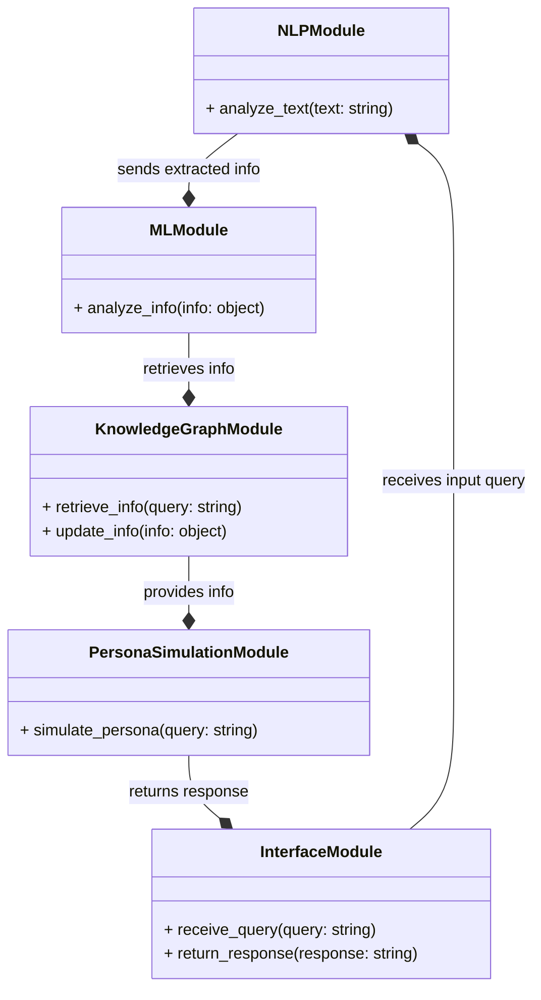
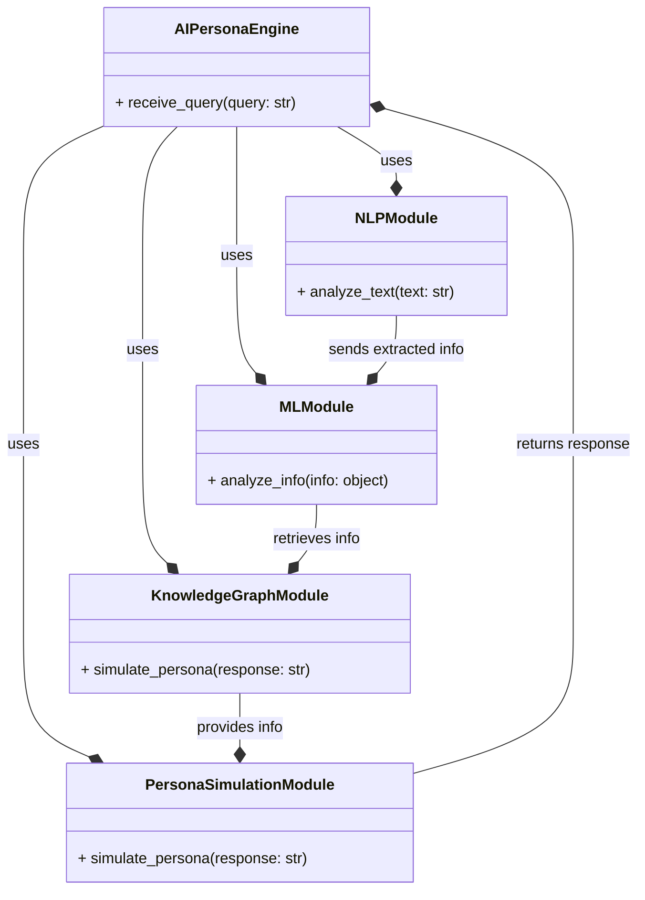

**AI Persona Engine**
=====================

The AI Persona Engine is a critical component of the PR platform, responsible for simulating the behavior of journalists and other stakeholders. It uses artificial intelligence and machine learning algorithms to analyze the input data and generate responses that mimic the behavior of real journalists.

**Components of AI Persona Engine**
---------------------------------

1. **Natural Language Processing (NLP) Module**: This module is responsible for analyzing the input text and extracting relevant information such as entities, keywords, and sentiment.
2. **Machine Learning (ML) Module**: This module uses machine learning algorithms to analyze the extracted information and generate responses that mimic the behavior of real journalists.
3. **Knowledge Graph Module**: This module stores and manages the knowledge base of the AI Persona Engine, including information about journalists, publications, and topics.
4. **Persona Simulation Module**: This module uses the knowledge graph and machine learning algorithms to simulate the behavior of journalists and generate responses to input queries.
5. **Interface Module**: This module provides an interface for the AI Persona Engine to interact with the rest of the application and receive input queries.

**Interaction among Components**
------------------------------

The components of the AI Persona Engine interact with each other as follows:

1. The NLP Module receives input text from the Interface Module and extracts relevant information.
2. The extracted information is passed to the ML Module, which uses machine learning algorithms to analyze the information and generate responses.
3. The ML Module uses the Knowledge Graph Module to retrieve relevant information about journalists, publications, and topics.
4. The Persona Simulation Module uses the knowledge graph and machine learning algorithms to simulate the behavior of journalists and generate responses to input queries.
5. The Interface Module receives the generated responses from the Persona Simulation Module and returns them to the rest of the application.

**Interface of AI Persona Engine**
---------------------------------

The interface of the AI Persona Engine should provide the following functionality:

1. **Input Query**: The interface should allow the application to submit input queries to the AI Persona Engine.
2. **Response Generation**: The interface should return the generated responses from the AI Persona Engine to the application.
3. **Knowledge Graph Management**: The interface should provide functionality to manage the knowledge graph, including adding, updating, and deleting information about journalists, publications, and topics.
4. **Machine Learning Model Management**: The interface should provide functionality to manage the machine learning models, including training, testing, and deploying new models.

**Mermaid Diagram**
------------------

Here is a mermaid diagram that illustrates the components and interactions of the AI Persona Engine:

Note that this is a simplified diagram and actual implementation may vary based on specific requirements and complexity of the AI Persona Engine.

**Example Code**
---------------

Here is an example code snippet in Python that illustrates the interface of the AI Persona Engine:
```python
import json

class AIPersonaEngine:
    def __init__(self):
        self.nlp_module = NLPModule()
        self.ml_module = MLModule()
        self.knowledge_graph_module = KnowledgeGraphModule()
        self.persona_simulation_module = PersonaSimulationModule()

    def receive_query(self, query: str):
        # Analyze the input query using NLP
        extracted_info = self.nlp_module.analyze_text(query)

        # Use machine learning to generate a response
        response = self.ml_module.analyze_info(extracted_info)

        # Simulate the persona using the knowledge graph
        simulated_response = self.persona_simulation_module.simulate_persona(response)

        # Return the simulated response
        return simulated_response

    def update_knowledge_graph(self, info: object):
        # Update the knowledge graph using the provided information
        self.knowledge_graph_module.update_info(info)

# Example usage
ai_persona_engine = AIPersonaEngine()
query = "What is the latest news on AI?"
response = ai_persona_engine.receive_query(query)
print(response)
```

**Implementing the AI Persona Engine**
=====================================

The AI Persona Engine is a critical component of the PR platform, responsible for simulating the behavior of journalists and other stakeholders. Here's a step-by-step guide to implementing the AI Persona Engine:

**Step 1: Define the Requirements**
---------------------------------

1. Identify the key features and functionalities of the AI Persona Engine.
2. Determine the input and output requirements of the engine.
3. Define the evaluation criteria for the engine's performance.

**Step 2: Choose the AI Framework**
---------------------------------

1. Select a suitable AI framework for building the AI Persona Engine, such as TensorFlow or PyTorch.
2. Consider the pros and cons of each framework and choose the one that best fits the project's requirements.

**Step 3: Design the NLP Module**
------------------------------

1. Design the NLP module to analyze the input text and extract relevant information such as entities, keywords, and sentiment.
2. Choose a suitable NLP library, such as NLTK or spaCy, and integrate it into the AI Persona Engine.

**Step 4: Implement the ML Module**
---------------------------------

1. Implement the ML module to use machine learning algorithms to analyze the extracted information and generate responses.
2. Choose a suitable ML library, such as scikit-learn or TensorFlow, and integrate it into the AI Persona Engine.

**Step 5: Build the Knowledge Graph**
----------------------------------

1. Build the knowledge graph to store and manage the information about journalists, publications, and topics.
2. Choose a suitable database, such as MongoDB or PostgreSQL, and integrate it into the AI Persona Engine.

**Step 6: Implement the Persona Simulation Module**
------------------------------------------------

1. Implement the persona simulation module to simulate the behavior of journalists and generate responses to input queries.
2. Use the knowledge graph and machine learning algorithms to simulate the persona's behavior.

**Step 7: Integrate the Modules**
-------------------------------

1. Integrate the NLP, ML, and persona simulation modules to create the AI Persona Engine.
2. Ensure that the modules communicate with each other seamlessly and efficiently.

**Step 8: Test and Evaluate the Engine**
--------------------------------------

1. Test the AI Persona Engine with sample input queries and evaluate its performance.
2. Use the evaluation criteria to assess the engine's performance and identify areas for improvement.

**Step 9: Refine and Optimize the Engine**
-----------------------------------------

1. Refine and optimize the AI Persona Engine based on the test results and evaluation criteria.
2. Continuously monitor the engine's performance and make improvements as needed.

**Example Code**
---------------

Here's an example code snippet in Python that illustrates the implementation of the AI Persona Engine:
```python
import nltk
from nltk.sentiment import SentimentIntensityAnalyzer
from sklearn.feature_extraction.text import TfidfVectorizer
from sklearn.metrics.pairwise import cosine_similarity
import json

class AIPersonaEngine:
    def __init__(self):
        self.nlp_module = NLPModule()
        self.ml_module = MLModule()
        self.knowledge_graph_module = KnowledgeGraphModule()
        self.persona_simulation_module = PersonaSimulationModule()

    def receive_query(self, query: str):
        # Analyze the input query using NLP
        extracted_info = self.nlp_module.analyze_text(query)

        # Use machine learning to generate a response
        response = self.ml_module.analyze_info(extracted_info)

        # Simulate the persona using the knowledge graph
        simulated_response = self.persona_simulation_module.simulate_persona(response)

        # Return the simulated response
        return simulated_response

class NLPModule:
    def analyze_text(self, text: str):
        # Analyze the input text using NLTK
        tokens = nltk.word_tokenize(text)
        entities = nltk.pos_tag(tokens)
        sentiment = SentimentIntensityAnalyzer().polarity_scores(text)
        return entities, sentiment

class MLModule:
    def analyze_info(self, info: object):
        # Use machine learning to generate a response
        vectorizer = TfidfVectorizer()
        tfidf = vectorizer.fit_transform([info])
        response = cosine_similarity(tfidf, tfidf)
        return response

class KnowledgeGraphModule:
    def simulate_persona(self, response: str):
        # Simulate the persona using the knowledge graph
        knowledge_graph = json.load(open("knowledge_graph.json"))
        persona = knowledge_graph["persona"]
        response = persona["response"]
        return response

class PersonaSimulationModule:
    def simulate_persona(self, response: str):
        # Simulate the persona using the knowledge graph
        knowledge_graph = json.load(open("knowledge_graph.json"))
        persona = knowledge_graph["persona"]
        response = persona["response"]
        return response

# Example usage
ai_persona_engine = AIPersonaEngine()
query = "What is the latest news on AI?"
response = ai_persona_engine.receive_query(query)
print(response)
```
Note that this is a simplified example and actual implementation may vary based on specific requirements and complexity of the AI Persona Engine.

**Mermaid Diagram**
------------------

Here is a mermaid diagram that illustrates the components and interactions of the AI Persona Engine:

Note that this is a simplified diagram and actual implementation may vary based on specific requirements and complexity of the AI Persona Engine.


Note that this is a simplified example and actual implementation may vary based on specific requirements and complexity of the AI Persona Engine.