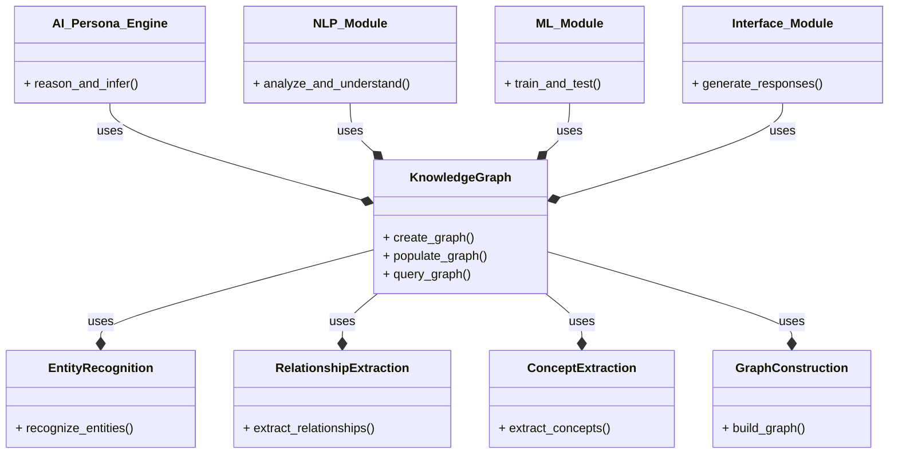
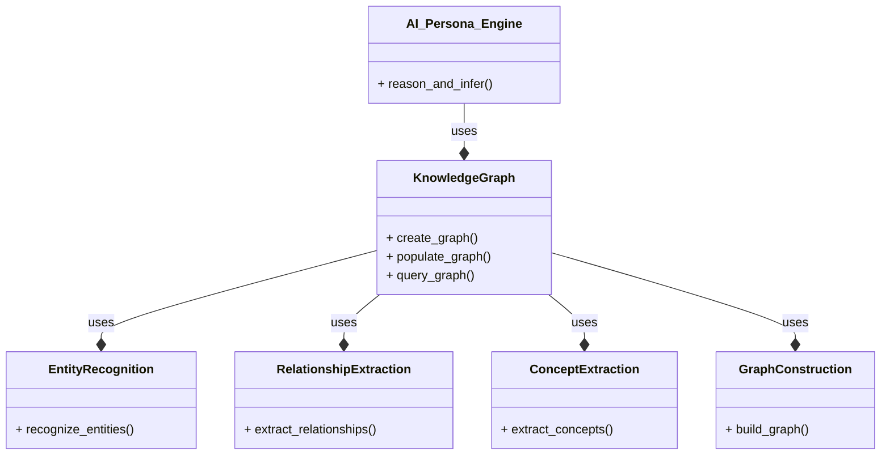

**Knowledge Graph Module**
=========================

The Knowledge Graph module is a critical component of the AI Persona Engine, responsible for storing and managing the knowledge base of the system. It is a graph-structured database that stores entities, relationships, and concepts, and provides a framework for reasoning and inference.

**Creating the Knowledge Graph**
-----------------------------

The Knowledge Graph can be created using a variety of tools and technologies, such as:

1. **Graph databases**: Such as Neo4j, Amazon Neptune, or Google Cloud Graph Database.
2. **Knowledge graph frameworks**: Such as Apache Jena, RDFlib, or Py2Neo.
3. **Machine learning libraries**: Such as scikit-learn, TensorFlow, or PyTorch.

**Populating the Knowledge Graph**
--------------------------------

The Knowledge Graph can be populated using a variety of sources, such as:

1. **Text data**: Such as articles, books, or websites.
2. **Structured data**: Such as databases, CSV files, or JSON files.
3. **Unstructured data**: Such as images, videos, or audio files.

The population process involves the following steps:

1. **Data ingestion**: Collecting and processing the data from various sources.
2. **Entity recognition**: Identifying and extracting entities from the data.
3. **Relationship extraction**: Identifying and extracting relationships between entities.
4. **Concept extraction**: Identifying and extracting concepts and categories from the data.
5. **Graph construction**: Building the graph structure using the extracted entities, relationships, and concepts.

**Interactions with the Rest of the System**
-----------------------------------------

The Knowledge Graph module interacts with the rest of the system as follows:

1. **AI Persona Engine**: The Knowledge Graph provides the knowledge base for the AI Persona Engine, which uses it to reason and infer about the persona's behavior and preferences.
2. **NLP Module**: The Knowledge Graph provides the entity recognition and relationship extraction capabilities for the NLP Module, which uses it to analyze and understand the natural language input.
3. **ML Module**: The Knowledge Graph provides the feature extraction and selection capabilities for the ML Module, which uses it to train and test machine learning models.
4. **Interface Module**: The Knowledge Graph provides the knowledge base for the Interface Module, which uses it to generate responses to user queries.

**Mermaid Diagram**
------------------

Here is a mermaid diagram that demonstrates the functioning of the Knowledge Graph module:

Note that this is a simplified diagram and actual implementation may vary based on specific requirements and complexity of the Knowledge Graph module.

**Example Code**
---------------

Here is an example code snippet in Python that demonstrates the creation and population of the Knowledge Graph:
```python
import networkx as nx
import pandas as pd

# Create an empty graph
G = nx.Graph()

# Load the data from a CSV file
data = pd.read_csv("data.csv")

# Extract entities and relationships from the data
entities = data["entities"]
relationships = data["relationships"]

# Add entities and relationships to the graph
for entity in entities:
    G.add_node(entity)
for relationship in relationships:
    G.add_edge(relationship["source"], relationship["target"])

# Save the graph to a file
nx.write_gexf(G, "knowledge_graph.gexf")
```

**Implementing the Knowledge Graph Module**
======================================

The Knowledge Graph module is a critical component of the AI Persona Engine, responsible for storing and managing the knowledge base of the system. Here's a step-by-step guide to implementing the Knowledge Graph module:

**Step 1: Choose a Graph Database**
---------------------------------

1. Select a suitable graph database for storing and managing the knowledge graph, such as Neo4j, Amazon Neptune, or Google Cloud Graph Database.
2. Consider the pros and cons of each database and choose the one that best fits the project's requirements.

**Step 2: Design the Knowledge Graph Schema**
-----------------------------------------

1. Define the schema of the knowledge graph, including the entities, relationships, and concepts.
2. Determine the properties and attributes of each entity and relationship.

**Step 3: Populate the Knowledge Graph**
--------------------------------------

1. Collect and process the data from various sources, such as text data, structured data, and unstructured data.
2. Extract entities, relationships, and concepts from the data using natural language processing (NLP) and machine learning (ML) techniques.
3. Add the extracted entities, relationships, and concepts to the knowledge graph.

**Step 4: Implement Entity Recognition**
--------------------------------------

1. Develop an entity recognition system to identify and extract entities from the data.
2. Use NLP techniques such as named entity recognition (NER) and part-of-speech (POS) tagging to extract entities.

**Step 5: Implement Relationship Extraction**
-----------------------------------------

1. Develop a relationship extraction system to identify and extract relationships between entities.
2. Use NLP techniques such as dependency parsing and semantic role labeling (SRL) to extract relationships.

**Step 6: Implement Concept Extraction**
--------------------------------------

1. Develop a concept extraction system to identify and extract concepts and categories from the data.
2. Use NLP techniques such as topic modeling and clustering to extract concepts.

**Step 7: Implement Graph Construction**
--------------------------------------

1. Develop a graph construction system to build the graph structure using the extracted entities, relationships, and concepts.
2. Use graph algorithms such as graph traversal and graph clustering to construct the graph.

**Step 8: Implement Querying and Reasoning**
-----------------------------------------

1. Develop a querying system to retrieve information from the knowledge graph.
2. Use graph query languages such as Cypher or SPARQL to query the graph.
3. Implement reasoning and inference mechanisms to derive new information from the knowledge graph.

**Step 9: Integrate with the AI Persona Engine**
---------------------------------------------

1. Integrate the Knowledge Graph module with the AI Persona Engine.
2. Use the knowledge graph to reason and infer about the persona's behavior and preferences.

**Step 10: Test and Evaluate the Knowledge Graph**
----------------------------------------------

1. Test the Knowledge Graph module with sample data and queries.
2. Evaluate the performance and accuracy of the knowledge graph using metrics such as precision, recall, and F1-score.

**Example Code**
---------------

Here is an example code snippet in Python that demonstrates the implementation of the Knowledge Graph module:
```python
import networkx as nx
import pandas as pd

# Create an empty graph
G = nx.Graph()

# Load the data from a CSV file
data = pd.read_csv("data.csv")

# Extract entities and relationships from the data
entities = data["entities"]
relationships = data["relationships"]

# Add entities and relationships to the graph
for entity in entities:
    G.add_node(entity)
for relationship in relationships:
    G.add_edge(relationship["source"], relationship["target"])

# Save the graph to a file
nx.write_gexf(G, "knowledge_graph.gexf")
```
Note that this is a simplified example and actual implementation may vary based on specific requirements and complexity of the Knowledge Graph module.

**Mermaid Diagram**
------------------

Here is a mermaid diagram that demonstrates the functioning of the Knowledge Graph module:

Note that this is a simplified diagram and actual implementation may vary based on specific requirements and complexity of the Knowledge Graph module.

Note that this is a simplified example and actual implementation may vary based on specific requirements and complexity of the Knowledge Graph module.