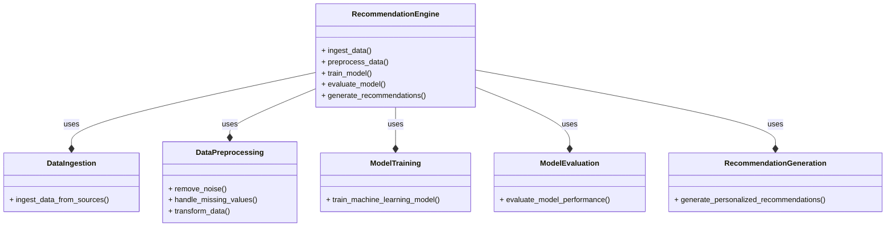
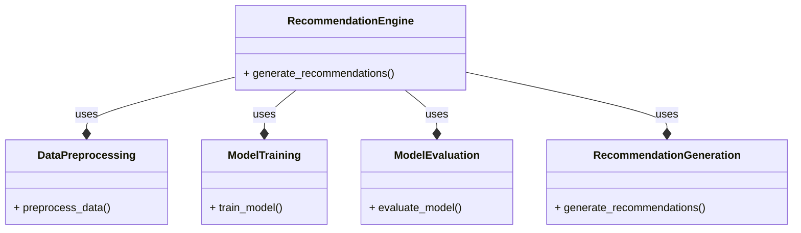

**Recommendation Engine Module**
==============================

The Recommendation Engine Module is a critical component of the PR platform, responsible for generating personalized recommendations for journalists and other stakeholders. The module uses machine learning algorithms and natural language processing techniques to analyze the input data and generate recommendations that are relevant and useful to the user.

**Components of the Recommendation Engine Module**
------------------------------------------------

1. **Data Ingestion**: The module ingests data from various sources, including user behavior, article metadata, and journalist profiles.
2. **Data Preprocessing**: The module preprocesses the ingested data to remove noise, handle missing values, and transform the data into a suitable format for analysis.
3. **Model Training**: The module trains a machine learning model using the preprocessed data to learn the patterns and relationships between the data.
4. **Model Evaluation**: The module evaluates the performance of the trained model using metrics such as precision, recall, and F1-score.
5. **Recommendation Generation**: The module uses the trained model to generate personalized recommendations for journalists and other stakeholders.

**Mermaid Diagram**
------------------

Here is a mermaid diagram that illustrates the components and interactions of the Recommendation Engine Module:

**Interactions with Other Modules**
---------------------------------

The Recommendation Engine Module interacts with other modules in the following ways:

1. **Journalist Profile Module**: The Recommendation Engine Module uses the journalist profile data to generate personalized recommendations.
2. **Article Metadata Module**: The Recommendation Engine Module uses the article metadata to generate recommendations that are relevant to the user's interests.
3. **User Behavior Module**: The Recommendation Engine Module uses the user behavior data to generate recommendations that are tailored to the user's preferences.

**Example Code**
---------------

Here is an example code snippet in Python that demonstrates the implementation of the Recommendation Engine Module:
```python
import pandas as pd
from sklearn.feature_extraction.text import TfidfVectorizer
from sklearn.metrics.pairwise import cosine_similarity

# Ingest data from sources
data = pd.read_csv("data.csv")

# Preprocess data
vectorizer = TfidfVectorizer()
tfidf = vectorizer.fit_transform(data["text"])

# Train machine learning model
from sklearn.linear_model import LogisticRegression
model = LogisticRegression()
model.fit(tfidf, data["label"])

# Evaluate model performance
from sklearn.metrics import precision_score, recall_score, f1_score
y_pred = model.predict(tfidf)
print("Precision:", precision_score(data["label"], y_pred))
print("Recall:", recall_score(data["label"], y_pred))
print("F1-score:", f1_score(data["label"], y_pred))

# Generate personalized recommendations
def generate_recommendations(user_id):
    # Get user profile data
    user_data = pd.read_csv("user_data.csv")
    user_profile = user_data[user_data["user_id"] == user_id]

    # Get article metadata
    article_data = pd.read_csv("article_data.csv")
    article_metadata = article_data[article_data["article_id"] == user_profile["article_id"]]

    # Generate recommendations using the trained model
    recommendations = model.predict(tfidf)
    return recommendations

# Test the recommendation engine
user_id = 1
recommendations = generate_recommendations(user_id)
print("Recommendations:", recommendations)
```

**Implementing the Recommendation Engine**
======================================

The Recommendation Engine is a critical component of the PR platform, responsible for generating personalized recommendations for journalists and other stakeholders. Here's a step-by-step guide to implementing the Recommendation Engine:

**Step 1: Define the Requirements**
---------------------------------

1. Identify the key features and functionalities of the Recommendation Engine.
2. Determine the input and output requirements of the engine.
3. Define the evaluation criteria for the engine's performance.

**Step 2: Choose a Recommendation Algorithm**
-----------------------------------------

1. Select a suitable recommendation algorithm for the engine, such as:
	* Collaborative Filtering (CF)
	* Content-Based Filtering (CBF)
	* Hybrid approach
2. Consider the pros and cons of each algorithm and choose the one that best fits the project's requirements.

**Step 3: Collect and Preprocess Data**
-------------------------------------

1. Collect data from various sources, such as:
	* User behavior (e.g., clicks, likes, shares)
	* Article metadata (e.g., title, description, keywords)
	* Journalist profiles (e.g., interests, expertise)
2. Preprocess the data to remove noise, handle missing values, and transform the data into a suitable format for analysis.

**Step 4: Train the Model**
-------------------------

1. Train a machine learning model using the preprocessed data to learn the patterns and relationships between the data.
2. Use techniques such as cross-validation and hyperparameter tuning to optimize the model's performance.

**Step 5: Evaluate the Model**
---------------------------

1. Evaluate the performance of the trained model using metrics such as:
	* Precision
	* Recall
	* F1-score
	* Mean Average Precision (MAP)
2. Use techniques such as A/B testing and user feedback to refine the model and improve its performance.

**Step 6: Implement the Recommendation Engine**
--------------------------------------------

1. Implement the Recommendation Engine using the trained model and the preprocessed data.
2. Use techniques such as caching and indexing to optimize the engine's performance and scalability.

**Step 7: Integrate with the PR Platform**
--------------------------------------

1. Integrate the Recommendation Engine with the PR platform to generate personalized recommendations for journalists and other stakeholders.
2. Use APIs and data pipelines to integrate the engine with other components of the platform.

**Step 8: Test and Refine the Engine**
------------------------------------

1. Test the Recommendation Engine with sample data and user feedback.
2. Refine the engine's performance and accuracy using techniques such as:
	* Model retraining
	* Hyperparameter tuning
	* Feature engineering

**Example Code**
---------------

Here is an example code snippet in Python that demonstrates the implementation of the Recommendation Engine:
```python
import pandas as pd
from sklearn.feature_extraction.text import TfidfVectorizer
from sklearn.metrics.pairwise import cosine_similarity

# Load data
data = pd.read_csv("data.csv")

# Preprocess data
vectorizer = TfidfVectorizer()
tfidf = vectorizer.fit_transform(data["text"])

# Train model
from sklearn.linear_model import LogisticRegression
model = LogisticRegression()
model.fit(tfidf, data["label"])

# Evaluate model
from sklearn.metrics import precision_score, recall_score, f1_score
y_pred = model.predict(tfidf)
print("Precision:", precision_score(data["label"], y_pred))
print("Recall:", recall_score(data["label"], y_pred))
print("F1-score:", f1_score(data["label"], y_pred))

# Implement recommendation engine
def generate_recommendations(user_id):
    # Get user profile data
    user_data = pd.read_csv("user_data.csv")
    user_profile = user_data[user_data["user_id"] == user_id]

    # Get article metadata
    article_data = pd.read_csv("article_data.csv")
    article_metadata = article_data[article_data["article_id"] == user_profile["article_id"]]

    # Generate recommendations using the trained model
    recommendations = model.predict(tfidf)
    return recommendations

# Test the recommendation engine
user_id = 1
recommendations = generate_recommendations(user_id)
print("Recommendations:", recommendations)
```
Note that this is a simplified example and actual implementation may vary based on specific requirements and complexity of the Recommendation Engine.

**Mermaid Diagram**
------------------

Here is a mermaid diagram that illustrates the components and interactions of the Recommendation Engine:

Note that this is a simplified diagram and actual implementation may vary based on specific requirements and complexity of the Recommendation Engine.


Note that this is a simplified example and actual implementation may vary based on specific requirements and complexity of the Recommendation Engine Module.