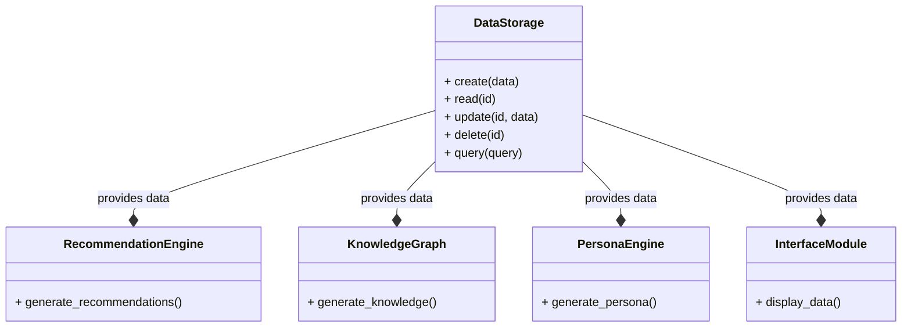
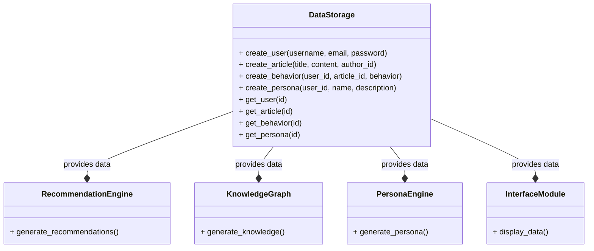

**Data Storage Module**
=====================

The Data Storage module is a critical component of the PR platform, responsible for storing and managing the data generated by the system. It is designed to provide a scalable and efficient way to store and retrieve data, ensuring that the system can handle large volumes of data and provide fast access to it.

**Difference from Knowledge Graph**
---------------------------------

The Data Storage module is different from the Knowledge Graph module in several ways:

1. **Purpose**: The primary purpose of the Data Storage module is to store and manage data, while the Knowledge Graph module is designed to store and manage knowledge and relationships between entities.
2. **Data Structure**: The Data Storage module uses a traditional relational database or NoSQL database, while the Knowledge Graph module uses a graph database.
3. **Data Type**: The Data Storage module stores structured and unstructured data, while the Knowledge Graph module stores knowledge and relationships between entities.

**Interface**
------------

The Data Storage module provides an interface for other parts of the system to interact with it. The interface includes the following methods:

1. **Create**: Create a new data record.
2. **Read**: Retrieve a data record.
3. **Update**: Update a data record.
4. **Delete**: Delete a data record.
5. **Query**: Query the data storage for specific data.

**Interaction with Other Parts of the System**
---------------------------------------------

The Data Storage module interacts with other parts of the system in the following ways:

1. **Recommendation Engine**: The Recommendation Engine module interacts with the Data Storage module to retrieve user behavior data and article metadata.
2. **Knowledge Graph**: The Knowledge Graph module interacts with the Data Storage module to retrieve knowledge and relationships between entities.
3. **Persona Engine**: The Persona Engine module interacts with the Data Storage module to retrieve user profile data and article metadata.
4. **Interface Module**: The Interface Module interacts with the Data Storage module to retrieve data for display to the user.

**Example Code**
---------------

Here is an example code snippet in Python that demonstrates the interface for the Data Storage module:
```python
import pymongo

class DataStorage:
    def __init__(self, db_name):
        self.db = pymongo.MongoClient()[db_name]

    def create(self, data):
        self.db.data.insert_one(data)

    def read(self, id):
        return self.db.data.find_one({"_id": id})

    def update(self, id, data):
        self.db.data.update_one({"_id": id}, {"$set": data})

    def delete(self, id):
        self.db.data.delete_one({"_id": id})

    def query(self, query):
        return self.db.data.find(query)

# Example usage
data_storage = DataStorage("pr_platform")
data = {"user_id": 1, "article_id": 1, "behavior": "click"}
data_storage.create(data)
print(data_storage.read(1))
data_storage.update(1, {"behavior": "like"})
print(data_storage.read(1))
data_storage.delete(1)
print(data_storage.query({"user_id": 1}))
```
Note that this is a simplified example and actual implementation may vary based on specific requirements and complexity of the Data Storage module.

**Mermaid Diagram**
------------------

Here is a mermaid diagram that illustrates the interaction between the Data Storage module and other parts of the system:


**Implementing the Data Storage Module**
=====================================

The Data Storage module is a critical component of the PR platform, responsible for storing and managing the data generated by the system. Here's a step-by-step guide to implementing the Data Storage module:

**Step 1: Choose a Database**
---------------------------

1. Select a suitable database management system for the Data Storage module, such as MongoDB, PostgreSQL, or MySQL.
2. Consider the pros and cons of each database and choose the one that best fits the project's requirements.

**Step 2: Design the Database Schema**
-------------------------------------

1. Define the database schema for the Data Storage module, including the tables and fields required to store the data.
2. Consider the data types and relationships between the tables.

**Schema**
----------

Here is an example schema for the Data Storage module:
```sql
CREATE TABLE users (
  id SERIAL PRIMARY KEY,
  username VARCHAR(255) NOT NULL,
  email VARCHAR(255) NOT NULL,
  password VARCHAR(255) NOT NULL
);

CREATE TABLE articles (
  id SERIAL PRIMARY KEY,
  title VARCHAR(255) NOT NULL,
  content TEXT NOT NULL,
  author_id INTEGER NOT NULL,
  FOREIGN KEY (author_id) REFERENCES users(id)
);

CREATE TABLE behaviors (
  id SERIAL PRIMARY KEY,
  user_id INTEGER NOT NULL,
  article_id INTEGER NOT NULL,
  behavior VARCHAR(255) NOT NULL,
  FOREIGN KEY (user_id) REFERENCES users(id),
  FOREIGN KEY (article_id) REFERENCES articles(id)
);

CREATE TABLE personas (
  id SERIAL PRIMARY KEY,
  user_id INTEGER NOT NULL,
  name VARCHAR(255) NOT NULL,
  description TEXT NOT NULL,
  FOREIGN KEY (user_id) REFERENCES users(id)
);
```
**Step 3: Implement the Database**
-------------------------------

1. Implement the database schema using the chosen database management system.
2. Use SQL commands to create the tables and fields.

**Step 4: Implement Data Storage and Retrieval**
---------------------------------------------

1. Implement the data storage and retrieval functionality using the database schema.
2. Use programming languages such as Python or Java to interact with the database.

**Example Code**
---------------

Here is an example code snippet in Python that demonstrates the implementation of the Data Storage module:
```python
import pymongo

class DataStorage:
    def __init__(self, db_name):
        self.db = pymongo.MongoClient()[db_name]

    def create_user(self, username, email, password):
        user = {"username": username, "email": email, "password": password}
        self.db.users.insert_one(user)

    def create_article(self, title, content, author_id):
        article = {"title": title, "content": content, "author_id": author_id}
        self.db.articles.insert_one(article)

    def create_behavior(self, user_id, article_id, behavior):
        behavior = {"user_id": user_id, "article_id": article_id, "behavior": behavior}
        self.db.behaviors.insert_one(behavior)

    def create_persona(self, user_id, name, description):
        persona = {"user_id": user_id, "name": name, "description": description}
        self.db.personas.insert_one(persona)

    def get_user(self, id):
        return self.db.users.find_one({"_id": id})

    def get_article(self, id):
        return self.db.articles.find_one({"_id": id})

    def get_behavior(self, id):
        return self.db.behaviors.find_one({"_id": id})

    def get_persona(self, id):
        return self.db.personas.find_one({"_id": id})
```
**Step 5: Test and Refine the Module**
------------------------------------

1. Test the Data Storage module to ensure that it is working correctly.
2. Refine the module as needed to improve its performance and functionality.

**Mermaid Diagram**
------------------

Here is a mermaid diagram that illustrates the interaction between the Data Storage module and other parts of the system:

Note that this is a simplified diagram and actual implementation may vary based on specific requirements and complexity of the Data Storage module.

Note that this is a simplified diagram and actual implementation may vary based on specific requirements and complexity of the Data Storage module.