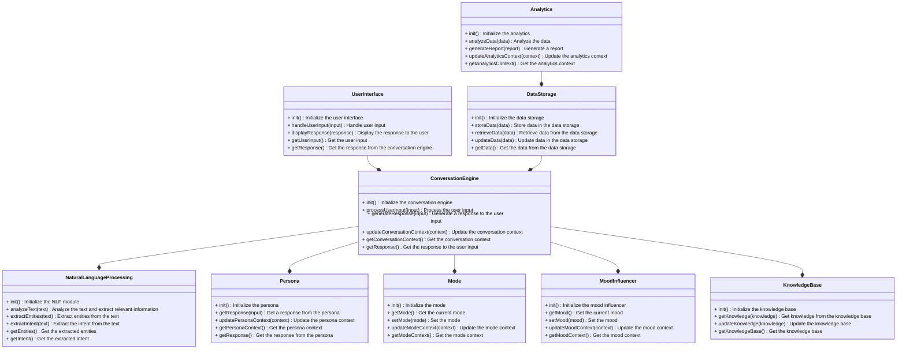
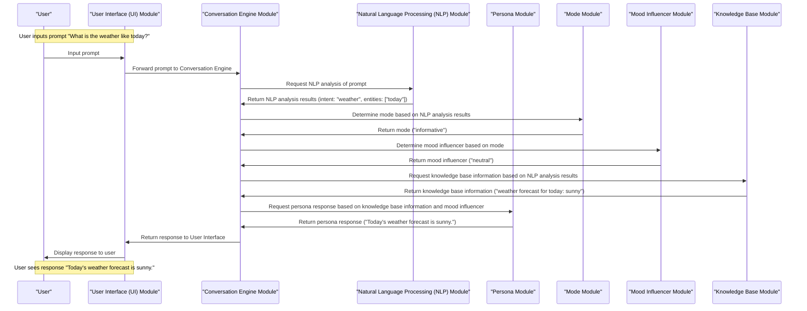

Here is a Mermaid file that provides an exhaustive list of all of the methods and properties exposed by all of the modules of the system:

This Mermaid file provides an exhaustive list of all of the methods and properties exposed by all of the modules of the system. It includes the following modules:

* UserInterface: Handles user input and displays the response to the user.
* ConversationEngine: Processes user input and generates a response.
* NaturalLanguageProcessing: Analyzes text and extracts relevant information.
* Persona: Provides a response based on the persona's context and mode.
* Mode: Determines the current mode and updates the mode context.
* MoodInfluencer: Determines the current mood and updates the mood context.
* KnowledgeBase: Provides knowledge from the knowledge base and updates the knowledge base.
* DataStorage: Stores and retrieves data from the data storage.
* Analytics: Analyzes data and generates a report.

Each module has a set of methods and properties that are exposed to other modules. The relationships between the modules are also shown in the Mermaid file.

Here is another Mermaid file that demonstrates a use case where a user inputs a prompt and gets a response:

This Mermaid file demonstrates how the user's prompt gets modified by different modules as it flows through the system. The prompt is first input by the user and forwarded to the Conversation Engine. The Conversation Engine then requests NLP analysis of the prompt, which returns the intent and entities of the prompt. The Conversation Engine then determines the mode based on the NLP analysis results and determines the mood influencer based on the mode. The Conversation Engine then requests knowledge base information based on the NLP analysis results and returns the response to the User Interface, which displays the response to the user.

The prompt gets modified by the following modules:

* NLP Module: The NLP module analyzes the prompt and returns the intent and entities of the prompt.
* Mode Module: The Mode module determines the mode based on the NLP analysis results.
* Mood Influencer Module: The Mood Influencer module determines the mood influencer based on the mode.
* Knowledge Base Module: The Knowledge Base module returns knowledge base information based on the NLP analysis results.
* Persona Module: The Persona module returns a persona response based on the knowledge base information and mood influencer.

The final response to the user is "Today's weather forecast is sunny.", which is a combination of the knowledge base information and the persona response.