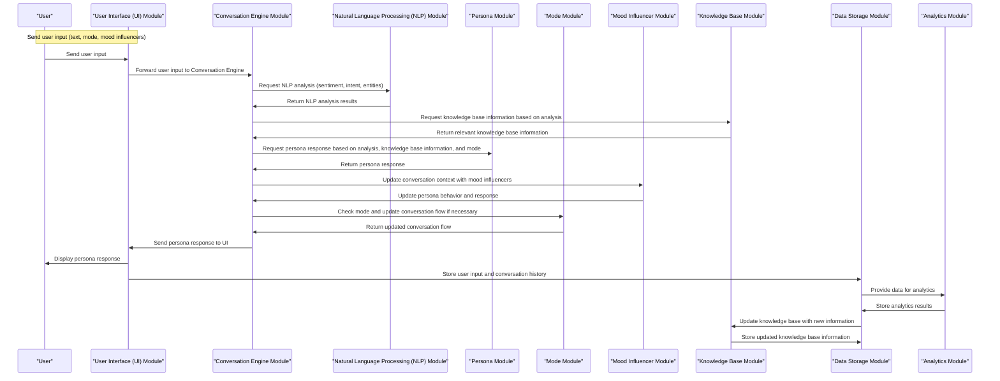

Here's a diagram illustrating the different modules and their interactions:

Now, let's go through an example dry run with a sample input from the user:

**User Input:**

* Text: "What's your opinion on the current state of artificial intelligence?"
* Mode: "Interviewer"
* Mood Influencers:
	+ Amicability: 0.7 ( neutral to friendly)
	+ Openness: 0.9 (very open)

**Dry Run:**

1. The user sends the input to the **User Interface (UI) Module**.
2. The UI Module forwards the input to the **Conversation Engine Module**.
3. The Conversation Engine Module requests the **Natural Language Processing (NLP) Module** to analyze the input text.
4. The NLP Module performs sentiment analysis, intent detection, and entity recognition, and returns the results to the Conversation Engine Module.
	* Sentiment: Neutral
	* Intent: Information seeking
	* Entities: Artificial intelligence
5. The Conversation Engine Module uses the NLP analysis results and the user's mode ("Interviewer") to request a response from the **Persona Module**.
6. The Persona Module generates a response based on the conversation context, mode, and persona characteristics. For this example, let's assume the persona is Christopher Hitchens.
	* Response: "Ah, the current state of artificial intelligence is a fascinating topic. While I'm skeptical about the notion of true AI, I believe we're making rapid progress in developing intelligent systems that can assist and augment human capabilities."
7. The Conversation Engine Module sends the persona response to the **Mood Influencer Module** to update the conversation context with the user's mood influencers.
8. The Mood Influencer Module updates the persona behavior and response based on the user's amicability (0.7) and openness (0.9) settings. In this case, the persona response becomes slightly more friendly and expansive.
	* Updated Response: "Ah, the current state of artificial intelligence is a fascinating topic, and I'm delighted to share my thoughts with you. While I'm skeptical about the notion of true AI, I believe we're making rapid progress in developing intelligent systems that can assist and augment human capabilities. In fact, I've been following the work of researchers like Nick Bostrom and Elon Musk, who are exploring the possibilities and risks of advanced AI."
9. The Conversation Engine Module checks the **Mode Module** to see if the conversation flow should be updated based on the user's input and mode.
10. The Mode Module returns an updated conversation flow, which in this case is to continue the interview-style conversation.
11. The Conversation Engine Module sends the updated persona response to the **User Interface (UI) Module**.
12. The UI Module displays the persona response to the user.
13. The UI Module stores the user input and conversation history in the **Data Storage Module**.
14. The Data Storage Module provides data to the **Analytics Module** for analysis and tracking.

This dry run demonstrates how the different modules interact to generate a persona response based on the user's input, mode, and mood influencers. The system's workflow involves a combination of natural language processing, persona-based response generation, and mood influencer-based updates to create a dynamic and engaging conversation experience.